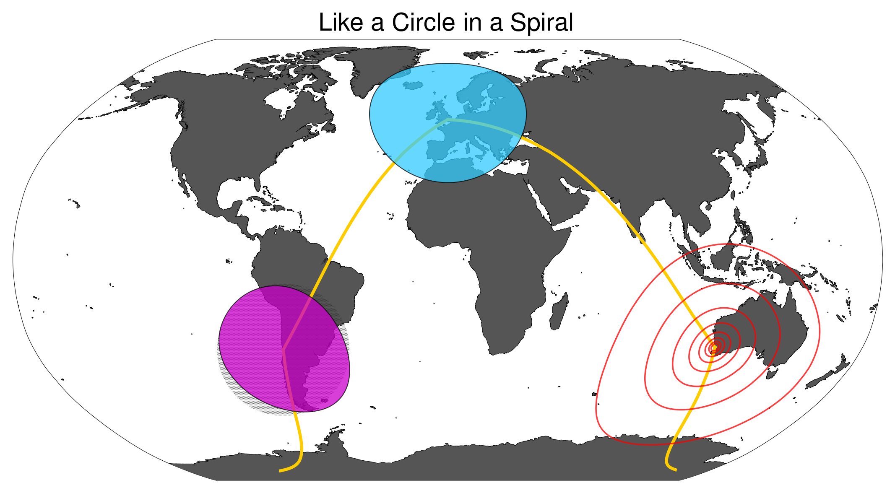

# Circles



> A map projection is a systematic transformation of the latitudes and longitudes of locations on the surface of a sphere or an ellipsoid into locations on a plane.  
— ([Snyder, J. P., 1989](http://pubs.usgs.gov/pp/1453/report.pdf))

Simply drawing a circle on that plane using cartesian coordinates will result in something that is…[wrong](http://www.economist.com/node/1788311).

Thomas Lecoq has [helpfully translated](http://www.geophysique.be/2011/02/19/matplotlib-basemap-tutorial-08-shooting-great-circles/) some [JS code written by Ed Williams](http://williams.best.vwh.net/gccalc.htm) into Python, in order to allow the correct calculation of great-circle distances for the [WGS84 ellipsoid](http://en.wikipedia.org/wiki/World_Geodetic_System). I've reproduced it here with some minor alterations, in the form of Circles, a small convenience library. It's designed to be used with the [Basemap](http://matplotlib.org/basemap/) extension to matplotlib, and it requires the [Numpy](http://www.numpy.org) library. Install it using pip: `pip install circles`

`Circles` exposes a single method, `circle()`. Pass it your Basemap instance, longitude and latitude of the point you'd like as the centre of your circle, and the radius. It will return a list of lon, lat tuples *in map projection coordinates*, which can be passed to your Basemap instance for plotting, or converted into Polygons using [Shapely](http://toblerity.org/shapely/manual.html), and then plotted using [Descartes](https://bitbucket.org/sgillies/descartes/).

A simple example:  

```Python
# the shaded circle has the wrong shape

from Circles.circles import circle
from mpl_toolkits.basemap import Basemap
import matplotlib.pyplot as plt
from shapely.geometry import Polygon, Point
from descartes import PolygonPatch
import numpy as np

# use the Robinson projection - it'll distort nicely
m = Basemap(resolution='l', projection='robin', lon_0=0)

radius = 2000
centerlon = 0.135875
centerlat = 51.5219198

# initialise a point and construct a buffered polygon
p = Point(m(centerlon, centerlat))
buffered = p.buffer(radius * 1000)

# same radius, but with calculated coordinates
casa = circle(m, centerlon, centerlat, radius)
pol = Polygon(casa)

# initialise a new plot and axes
plt.clf()
fig = plt.figure()
ax = fig.add_subplot(111, axisbg='w', frame_on=False)

# draw map features
m.drawmapboundary(fill_color='#dfedff', linewidth=0.25, zorder=0, ax=ax)
m.drawcountries(linewidth=.25, color='#000000', zorder=2, ax=ax)
m.drawcoastlines(linewidth=1., zorder=1, ax=ax)
m.fillcontinents(color='#555555', lake_color='#C4C4C4',zorder=1, ax=ax)
m.drawparallels(np.arange(-90., 120., 30.), alpha=0.5, lw=0.25, zorder=1, ax=ax)
m.drawmeridians(np.arange(0., 360., 60.), alpha=0.5, lw=0.25, zorder=1, ax=ax)

# draw circles
incorrect = PolygonPatch(buffered, fc='none', ec='#333333', lw=0, ls='dotted', hatch='....', zorder=1)
correct = PolygonPatch(pol, fc='#00BABA', ec='#ffffff', alpha=.5, zorder=3)
ax.add_patch(incorrect)
ax.add_patch(correct)

# with apologies to the Sugababes
plt.title("Round round baby, round round")
plt.tight_layout()
fig.set_size_inches(12., 8.)
plt.show()
```

The shaded circle centred on Ritoque is drawn using cartesian coordinates, while the fuchsia, blue and transparent circles – the latter two centred on London and Perth, respectively – have been drawn using Circles. As can be seen, these are correctly distorted, in line with the parallels and meridians drawn on the [Robinson projection](http://en.wikipedia.org/wiki/Robinson_Projection), which distorts moderately at the latitudes in [question](http://www.openstreetmap.org/#map=18/51.52192/-0.13585).  

The IPython Notebook used to generate the graphic can be viewed [here](http://nbviewer.ipython.org/github/urschrei/Circles/blob/master/circles.ipynb).

# TODO
- [ ] Wrapping the circle correctly across map bounds is a very tricky problem. I gather [Leaflet](http://leafletjs.com/reference.html#circle) does this well as of 0.8

## Citation

This work may be cited using the following DOI:  

[](https://zenodo.org/record/10084)
